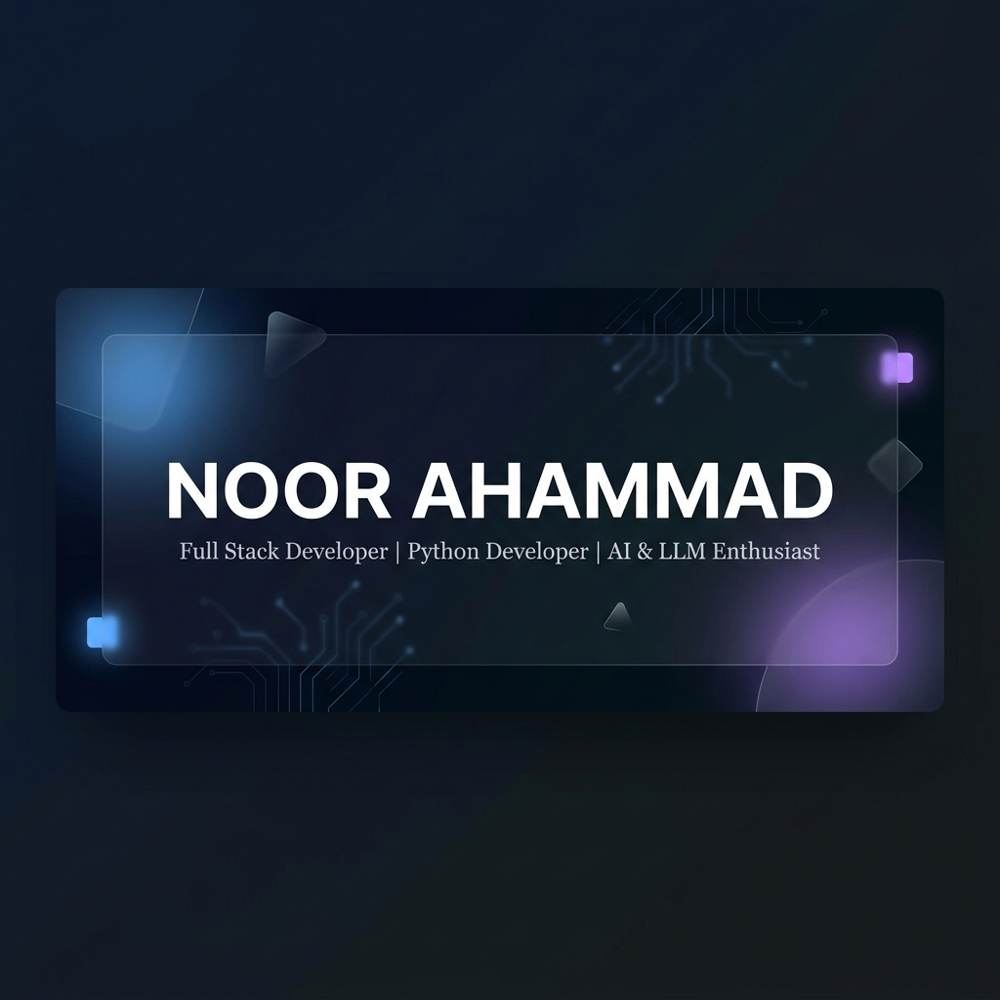

<!-- ═══════════════════════════════════════════════════════════════════════════════ -->
<!-- GITHUB PROFILE README — NOOR AHAMMAD                                        -->
<!-- Enterprise-Quality | Dark Theme | Glassmorphism Aesthetic                    -->
<!-- ═══════════════════════════════════════════════════════════════════════════════ -->

<!-- BANNER -->
<div align="center">
  
</div>

<!-- ANIMATED TYPING SVG -->
<div align="center">
  <a href="https://github.com/pnoorahammad">
    
  </a>
</div>

<br/>

<!-- PROFILE BADGES -->
<div align="center">
  <a href="https://linkedin.com/in/noorahammad15"></a>&nbsp;
  <a href="https://github.com/pnoorahammad"></a>&nbsp;
  <a href="https://leetcode.com/u/NoorAhammad/"></a>&nbsp;
  <a href="https://www.codechef.com/users/kl_9921004570"></a>&nbsp;
  <a href="mailto:pogakunoor5158@gmail.com"></a>
</div>

<div align="center">
  
</div>

<br/>

<!-- ═══════════════════════════════════════════════════════════════════════════════ -->
<!-- ABOUT ME                                                                      -->
<!-- ═══════════════════════════════════════════════════════════════════════════════ -->

##  &nbsp;About Me


I'm **Noor Ahammad**, a passionate Software Engineer and 2025 Computer Science graduate based in **Bengaluru, Karnataka, India**. I specialize in building robust backend systems, AI-powered applications, and production-ready full stack software.

I thrive at the intersection of clean engineering and intelligent systems — whether it's designing RESTful APIs with Spring Boot, building LLM-powered platforms with FastAPI, or deploying containerized services with Docker.

- &nbsp; **B.Tech in Computer Science & Engineering** — Class of 2025
- &nbsp; Backend-focused with deep expertise in **Python** and **Java**
- &nbsp; Exploring **Agentic AI, RAG pipelines, and LLM orchestration**
- &nbsp; Open to **Software Engineer, Python Developer, AI Engineer & Full Stack Developer** roles
- &nbsp; **Immediate Joiner** — ready to contribute from Day 1

<br clear="right"/>

---

<!-- ═══════════════════════════════════════════════════════════════════════════════ -->
<!-- CAREER OBJECTIVE                                                              -->
<!-- ═══════════════════════════════════════════════════════════════════════════════ -->

## &nbsp;Career Objective

> *Driven by a deep passion for software engineering, I aim to contribute to teams building impactful products at scale. With strong foundations in backend development, full stack engineering, and a growing expertise in AI/LLM systems, I continuously seek to learn modern technologies, write clean and maintainable code, and deliver solutions that genuinely solve real-world problems. I'm looking for an opportunity where I can grow as an engineer while creating meaningful software that matters.*

---

<!-- ═══════════════════════════════════════════════════════════════════════════════ -->
<!-- EDUCATION                                                                     -->
<!-- ═══════════════════════════════════════════════════════════════════════════════ -->

## &nbsp;Education

<table>
<tr>
<td width="80" align="center">
  
</td>
<td>
  <strong>Kalasalingam Academy of Research and Education</strong><br/>
  Bachelor of Technology — Computer Science & Engineering<br/>
  <sub>2021 – 2025</sub>
</td>
</tr>
</table>

---

<!-- ═══════════════════════════════════════════════════════════════════════════════ -->
<!-- INTERNSHIP TIMELINE                                                           -->
<!-- ═══════════════════════════════════════════════════════════════════════════════ -->

## &nbsp;Internship Experience

```
┌─────────────────────────────────────────────────────────────────────┐
│                                                                     │
│  ◆  AICTE — Web Development Intern                                  │
│  │  ▸ Built responsive, accessible web pages using HTML, CSS & JS   │
│  │  ▸ Collaborated on projects using Git & GitHub workflows         │
│  │  ▸ Followed industry-standard development practices              │
│  │                                                                   │
│  ◆  MotionCut — Web Development Intern                              │
│  │  ▸ Developed interactive front-end components and responsive UI  │
│  │  ▸ Gained hands-on experience with modern web technologies       │
│  │  ▸ Delivered production-quality code within sprint cycles        │
│                                                                     │
└─────────────────────────────────────────────────────────────────────┘
```

---

<!-- ═══════════════════════════════════════════════════════════════════════════════ -->
<!-- CERTIFICATIONS                                                                -->
<!-- ═══════════════════════════════════════════════════════════════════════════════ -->

## &nbsp;Certifications

<div align="center">
<table>
<tr>
<td align="center" width="400">
  <br/><br/>
  <strong>Java Full Stack Development</strong><br/>
  <sub>AchieversIT</sub><br/>
  <sub>Spring Boot · Hibernate · REST APIs · MySQL · React</sub>
</td>
<td align="center" width="400">
  <br/><br/>
  <strong>CSS, Bootstrap, JavaScript & PHP Stack</strong><br/>
  <sub>Udemy</sub><br/>
  <sub>Frontend Development · Responsive Design · Server-Side Scripting</sub>
</td>
</tr>
</table>
</div>

---

<!-- ═══════════════════════════════════════════════════════════════════════════════ -->
<!-- TECH STACK                                                                    -->
<!-- ═══════════════════════════════════════════════════════════════════════════════ -->

## &nbsp;Tech Stack

<div align="center">

### Languages


### Frontend


### Backend & Frameworks


### Databases


### Developer Tools


</div>

---

<!-- ═══════════════════════════════════════════════════════════════════════════════ -->
<!-- FEATURED PROJECTS                                                             -->
<!-- ═══════════════════════════════════════════════════════════════════════════════ -->

## &nbsp;Featured Projects

<div align="center">

<!-- ROW 1 -->
<table>
<tr>
<td width="50%" valign="top">

###  Binance Futures Trading Bot
Production-grade automated cryptocurrency trading bot with real-time market analysis, risk management, and position tracking.

**Key Features:** Live trading execution, Technical indicators, Risk controls, Real-time monitoring


<a href="https://github.com/pnoorahammad/Binance-Futures-Trading-Bot"></a>

</td>
<td width="50%" valign="top">

###  AI Chat Organization Platform
LLM-powered intelligent chatbot platform with conversation management, context-aware responses, and a modern React frontend.

**Key Features:** LLM integration, Conversation history, Context management, Responsive UI


<a href="https://github.com/pnoorahammad/AI-Chat-Organization-Platform"></a>

</td>
</tr>
</table>

<!-- ROW 2 -->
<table>
<tr>
<td width="50%" valign="top">

###  ElectroMart
Full-featured e-commerce platform with product management, JWT authentication, role-based access, and a secure checkout flow.

**Key Features:** JWT Auth, Role-based access, Product catalog, Order management


<a href="https://github.com/pnoorahammad/ElectroMart"></a>

</td>
<td width="50%" valign="top">

###  Face Recognition System
Real-time face detection and recognition system using computer vision with high accuracy and live camera feed processing.

**Key Features:** Real-time detection, Deep learning models, Live camera feed, High accuracy


<a href="https://github.com/pnoorahammad/Face-Recognition-System"></a>

</td>
</tr>
</table>

<!-- ROW 3 -->
<table>
<tr>
<td width="50%" valign="top">

###  MallSphere
AI-powered interactive sales and mall management platform with product recommendations and analytics dashboards.

**Key Features:** AI recommendations, Sales analytics, Interactive dashboard, Smart search


<a href="https://github.com/pnoorahammad/MallSphere"></a>

</td>
<td width="50%" valign="top">

###  Student Result Management System
Comprehensive student result management application with CRUD operations, grade computation, and report generation.

**Key Features:** CRUD operations, Grade computation, Report generation, Admin panel


<a href="https://github.com/pnoorahammad/Student-Result-Management-System"></a>

</td>
</tr>
</table>

<!-- ROW 4 -->
<table>
<tr>
<td width="50%" valign="top">

###  Weather Forecast Application
Modern weather dashboard with real-time forecasts, location search, and dynamic weather visualizations using REST APIs.

**Key Features:** Real-time data, Location search, 7-day forecast, Dynamic UI


<a href="https://github.com/pnoorahammad/Weather-Forecast-Application"></a>

</td>
<td width="50%" valign="top">

###  Medical Image Analysis System
Deep learning-based medical image analysis for chest X-ray classification using CNNs, enabling automated diagnostics.

**Key Features:** CNN classification, X-ray analysis, TensorFlow models, Automated diagnostics


<a href="https://github.com/pnoorahammad/Medical-Image-Analysis-System"></a>

</td>
</tr>
</table>

<!-- ROW 5 -->
<table>
<tr>
<td width="50%" valign="top">

###  Portfolio Website
Personal developer portfolio showcasing projects, skills, and professional journey with a modern, responsive design.

**Key Features:** Responsive design, Project showcase, Skills section, Contact form


<a href="https://github.com/pnoorahammad/Portfolio-Website"></a>

</td>
<td width="50%" valign="top">

###  Playto Payout Engine
Backend payout engine for a gaming platform with transaction management, wallet systems, and secure payment processing.

**Key Features:** Payout processing, Wallet management, Transaction logs, Secure APIs


<a href="https://github.com/pnoorahammad/Playto-Payout-Engine"></a>

</td>
</tr>
</table>

<!-- ROW 6 -->
<table>
<tr>
<td width="50%" valign="top">

###  DMH Software Developer Trial Task
Full stack development trial task demonstrating clean architecture, API development, and modern software engineering practices.

**Key Features:** Clean architecture, API design, Full stack implementation, Best practices


<a href="https://github.com/pnoorahammad/DMH-Software-Developer-Trial-Task"></a>

</td>
<td width="50%" valign="top">

&nbsp;

</td>
</tr>
</table>

</div>

---

<!-- ═══════════════════════════════════════════════════════════════════════════════ -->
<!-- CURRENTLY LEARNING                                                            -->
<!-- ═══════════════════════════════════════════════════════════════════════════════ -->

## &nbsp;Currently Learning

<div align="center">


</div>

---

<!-- ═══════════════════════════════════════════════════════════════════════════════ -->
<!-- GITHUB ANALYTICS                                                              -->
<!-- ═══════════════════════════════════════════════════════════════════════════════ -->

## &nbsp;GitHub Analytics

<div align="center">

<!-- Stats & Languages Side by Side -->
<a href="https://github.com/pnoorahammad">
  
</a>&nbsp;&nbsp;
<a href="https://github.com/pnoorahammad">
  
</a>

<br/><br/>

<!-- Streak Stats -->
<a href="https://github.com/pnoorahammad">
  
</a>

<br/><br/>

<!-- Activity Graph -->
<a href="https://github.com/pnoorahammad">
  
</a>

<br/><br/>

<!-- GitHub Trophies -->
<a href="https://github.com/pnoorahammad">
  
</a>

</div>

---

<!-- ═══════════════════════════════════════════════════════════════════════════════ -->
<!-- CONTRIBUTION SNAKE                                                            -->
<!-- ═══════════════════════════════════════════════════════════════════════════════ -->

## &nbsp;Contribution Graph

<div align="center">
  <picture>
    <source media="(prefers-color-scheme: dark)" srcset="https://raw.githubusercontent.com/pnoorahammad/pnoorahammad/output/github-snake-dark.svg" />
    <source media="(prefers-color-scheme: light)" srcset="https://raw.githubusercontent.com/pnoorahammad/pnoorahammad/output/github-snake.svg" />
    
  </picture>
</div>

> **Setup:** To enable the snake animation, add the [GitHub Snake workflow](.github/workflows/snake.yml) to your profile repository. See the [Upload Guide](./UPLOAD_GUIDE.md) for instructions.

---

<!-- ═══════════════════════════════════════════════════════════════════════════════ -->
<!-- OPTIONAL SECTIONS                                                             -->
<!-- ═══════════════════════════════════════════════════════════════════════════════ -->

## &nbsp;Achievements & Highlights

- Designed and deployed a **production-ready crypto trading bot** handling real-time market data
- Built an **AI-powered chatbot platform** with LLM integration from scratch
- Developed multiple **full stack applications** using Spring Boot and React ecosystems
- Created a **medical image analysis system** using deep learning for automated diagnostics
- Completed **two industry internships** focused on web development
- Earned certifications in **Java Full Stack Development** and **Web Technologies**

---

## &nbsp;Development Workflow

<div align="center">

```
  Ideate  →  Design  →  Develop  →  Test  →  Deploy  →  Iterate
    💡         📐         💻        🧪       🚀         🔄
```

</div>

| Category | Tools |
|---|---|
| **IDE** | IntelliJ IDEA, VS Code |
| **Version Control** | Git, GitHub |
| **API Testing** | Postman |
| **Containerization** | Docker |
| **OS** | Windows, Linux |
| **Languages** | English, Hindi, Telugu |

---

## &nbsp;Fun Facts

- I write backend code for fun — REST APIs are my comfort zone
- I've automated crypto trading before most people understand candlestick charts
- I believe **clean code** is as important as working code
- My debugging mantra: *"If it works, don't touch it. If it doesn't, add a print statement."*
- Currently on a mission to build something meaningful with **Agentic AI**

---

## &nbsp;Daily Learning

```python
class NoorAhammad:
    def __init__(self):
        self.name = "Noor Ahammad"
        self.role = "Software Engineer"
        self.languages = ["Python", "Java", "JavaScript", "SQL", "C++"]
        self.interests = ["Backend Development", "AI/ML", "System Design"]
        self.currently_learning = ["Agentic AI", "LangChain", "RAG", "Kubernetes"]
        self.open_to = ["Software Engineer", "Python Developer", "AI Engineer"]
        self.fun_fact = "I automate everything — even my learning schedule."

    def say_hi(self):
        print("Thanks for dropping by! Let's build something amazing together.")

me = NoorAhammad()
me.say_hi()
```

---

## &nbsp;Open Source Goals

- Contribute to **LangChain** and **FastAPI** ecosystems
- Build and publish open-source **AI tools** for developers
- Create beginner-friendly **Spring Boot starter templates**
- Share knowledge through well-documented repositories
- Collaborate on projects that solve real-world problems

---

<!-- ═══════════════════════════════════════════════════════════════════════════════ -->
<!-- CONNECT                                                                       -->
<!-- ═══════════════════════════════════════════════════════════════════════════════ -->

## &nbsp;Let's Connect

<div align="center">

<a href="https://linkedin.com/in/noorahammad15"></a>&nbsp;&nbsp;
<a href="https://github.com/pnoorahammad"></a>&nbsp;&nbsp;
<a href="https://leetcode.com/u/NoorAhammad/"></a>&nbsp;&nbsp;
<a href="https://www.codechef.com/users/kl_9921004570"></a>&nbsp;&nbsp;
<a href="mailto:pogakunoor5158@gmail.com"></a>

</div>

---

<!-- ═══════════════════════════════════════════════════════════════════════════════ -->
<!-- TECH QUOTE                                                                    -->
<!-- ═══════════════════════════════════════════════════════════════════════════════ -->

<div align="center">
  
</div>

---

<!-- ═══════════════════════════════════════════════════════════════════════════════ -->
<!-- FOOTER                                                                        -->
<!-- ═══════════════════════════════════════════════════════════════════════════════ -->

<div align="center">
  
</div>

<div align="center">
  <sub>Thank you for visiting my GitHub profile. Let's build something extraordinary together.</sub>
  <br/>
  <sub>Made with dedication and a lot of coffee.</sub>
  <br/><br/>
  <a href="https://github.com/pnoorahammad"></a>
</div>
